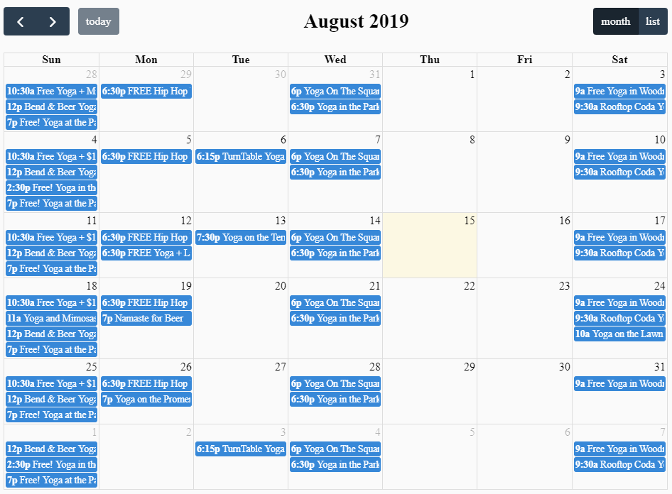

# Calendar Implementation for Atlanta Yogis

See interactive calendar at main site: http://atlantayogis.com

Implements:
- FullCalendar (JavaScript library)
- qTip (JavaScript library)
- Data sourced from Google Calendar

I built a calendar that integrates FullCalendar to create month-view and list-view calendars populated with events sourced from a public Google Calendar I manage. I added the qTip library to support flexible tooltips on the month-view calendar and added expanding code for the list-view calendar.